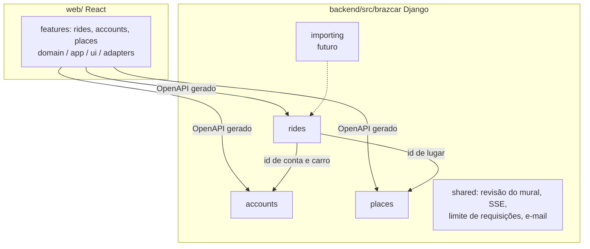

# Arquitetura

## Contexto

```mermaid
flowchart LR
    P[Passageiro] --> W[PWA no Vercel<br/>brazcar.elj-labs.org]
    M[Motorista] --> W
    W -->|HTTPS, cookie de sessão| CF[Cloudflare<br/>túnel]
    CF --> T[Traefik]
    T --> A[API Django ASGI<br/>api-brazcar.elj-labs.org]
    A --> DB[(Banco único<br/>SQLite ou Postgres)]
    A -->|SMTP| R[Resend]
    W -.wa.me.-> WA[WhatsApp]
    X[Worker do extrator<br/>futuro] --> DB
```

Tudo que é público passa pelo túnel do Cloudflare: a máquina não tem IP público, e o TLS e o
HTTP/2 são entregues por ele, não pelo Traefik.

## Blocos



Cada contexto é um pacote com três camadas.

| Camada | Contém | Pode importar |
|---|---|---|
| `domain/` | entidades, value objects e eventos, em Pydantic congelado | stdlib, Pydantic, o próprio domínio |
| `application/` | casos de uso `async` e portas (`Protocol`) | o anterior e a própria camada |
| `adapters/` | app Django (models, migrations, admin), rotas ninja, repositórios | tudo |

Referência entre contextos é por identificador. `shared` guarda infraestrutura que não é de
nenhum contexto.

## Fluxos que importam

**Publicar ou alterar uma carona.** A rota ninja monta o DTO e chama o caso de uso. A entidade
valida as invariantes e emite eventos. O repositório, numa única função síncrona com `atomic`,
grava o estado, acrescenta os eventos ao histórico e incrementa a revisão do mural (ADR-0008).

**Atualizar o mural sem recarregar.** Uma tarefa única no processo web lê a revisão uma vez por
segundo. Quando o número muda, escreve "mudou, revisão N" em todas as conexões SSE abertas. Cada
celular espera até dois segundos aleatórios e busca a lista, que fica em cache por revisão
(ADR-0010). Ao focar a aba ou voltar a rede, o app busca de novo de qualquer forma.
A conexão cai por rotina, porque o túnel a derruba em rajadas e o iOS a mata em segundo plano:
o servidor manda um evento `ping` a cada 15s, e o cliente reconecta sozinho por silêncio, ao
voltar ao foco e ao voltar a rede. Medido pelo caminho real e num iPhone (ADR-0013).

**Contato.** A lista nunca traz telefone nem placa. O botão chama uma rota própria, que exige
login, aplica limite por conta, registra o pedido e devolve o link `wa.me` com mensagem pronta e a
placa (ADR-0006).

## Conceitos transversais

- **Banco único e plugável.** O ORM escolhe SQLite ou Postgres pela URL. O contrato de
  repositório roda nos dois bancos para provar isso (ADR-0007).
- **Sessão entre origens irmãs.** Front e API são subdomínios de `elj-labs.org`. Cookie de
  sessão httpOnly com `SameSite=Lax`, CORS com credenciais e checagem de `Origin` (ADR-0012).
- **Contrato da API.** O `contract/openapi.json` é gerado do ninja e versionado. O front gera os
  tipos dele. O CI falha se o arquivo divergir do código.
- **Regras só no backend.** A API devolve a situação calculada e as ações permitidas (ADR-0011).
- **Observabilidade.** Logs estruturados em JSON na saída padrão e um endpoint de saúde. Nada de terceiros.
- **Limite de requisições.** Na aplicação, atrás de uma porta, por conta ou por IP.
- **E-mail.** Porta de envio com o backend SMTP do Django como adaptador; o fornecedor é variável de ambiente.
- **Versão do app.** Service worker em modo `prompt`, e a API informa a versão mínima aceita.

## Execução

Um `compose.yml` no molde do JayceFinance: serviço `api`, serviço `worker` (quando o extrator
entrar) e `postgres`, todos com `restart: unless-stopped`, na rede externa `web` do Traefik.
Imagens vêm do GHCR. O entrypoint migra só quando `RUN_MIGRATIONS=1`, ligado apenas na API, e o
worker espera a API ficar saudável.

## Qualidade

Rápido e a cada commit, no hook de `pre-commit` e no GitHub: formatação, lint, tipos, testes de
domínio, teste de arquitetura, divergência do OpenAPI, links da documentação. Pesado e local, no
hook de `pre-push` e na task completa: contrato de repositório em SQLite e Postgres, Schemathesis
sobre o OpenAPI, E2E com Playwright.
