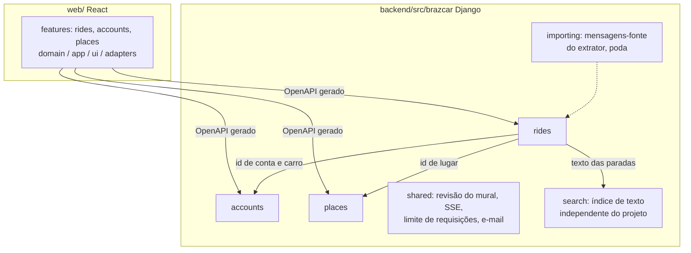

# Arquitetura

## Contexto

```mermaid
flowchart LR
    P[Passageiro] --> W[PWA no Vercel<br/>brazcar.elj-labs.org]
    M[Motorista] --> W
    W -->|HTTPS, cookie de sessão| CF[Cloudflare<br/>túnel]
    CF --> T[Traefik]
    T --> A[API Django ASGI<br/>api-brazcar.elj-labs.org]
    A --> DB[(Banco único<br/>SQLite ou Postgres)]
    A -->|SMTP| R[Resend]
    W -.wa.me.-> WA[WhatsApp]
    X[Worker do extrator<br/>mesma imagem da API] --> DB
    X -.lê.-> WA
```

Tudo que é público passa pelo túnel do Cloudflare: a máquina não tem IP público, e o TLS e o
HTTP/2 são entregues por ele, não pelo Traefik.

## Blocos



Cada contexto é um pacote com três camadas.

| Camada | Contém | Pode importar |
|---|---|---|
| `domain/` | entidades, value objects e eventos, em Pydantic congelado | stdlib, Pydantic, o próprio domínio |
| `application/` | casos de uso `async` e portas (`Protocol`) | o anterior e a própria camada |
| `adapters/` | app Django (models, migrations, comandos), rotas ninja, repositórios | tudo |

Referência entre contextos é por identificador. `shared` guarda infraestrutura que não é de
nenhum contexto.

## Fluxos que importam

**Publicar ou alterar uma carona.** A rota ninja monta o DTO e chama o caso de uso. A entidade
valida as invariantes e emite eventos. O repositório, numa única função síncrona com `atomic`,
grava o estado, acrescenta os eventos ao histórico e incrementa a revisão do mural (ADR-0008).

**Atualizar o mural sem recarregar.** Uma tarefa única no processo web lê a revisão uma vez por
segundo. Quando o número muda, escreve "mudou, revisão N" em todas as conexões SSE abertas. Cada
celular espera até dois segundos aleatórios e busca a lista, que fica em cache por revisão
(ADR-0010). Ao focar a aba ou voltar a rede, o app busca de novo de qualquer forma.
A conexão cai por rotina, porque o túnel a derruba em rajadas e o iOS a mata em segundo plano:
o servidor manda um evento `ping` a cada 15s, e o cliente reconecta sozinho por silêncio (35s), ao
voltar ao foco e ao voltar a rede. Ao reconectar, o primeiro quadro do stream é a revisão atual:
só busca se mudou. Medido pelo caminho real, numa aba e com o app instalado (ADR-0013, ADR-0014).

**Ler os grupos de WhatsApp.** O worker roda o extrator (repo somente leitura, ADR-0009) com um
`DjangoStore` como porta de escrita: só texto de grupo observado, de outra pessoa, com telefone,
vira mensagem-fonte, única por conta e id (D-111). Os grupos são JIDs com rótulo no ambiente (D-109).
O handler do extrator só acorda uma varredura no mesmo processo (D-112). A retenção (D-119) existe
duas vezes de propósito: como caso de uso que a varredura aplica, e como job do `pg_cron` no Postgres
da máquina; um contrato prova que apagam o mesmo. A sessão do WhatsApp fica num papel e schema
próprios do mesmo Postgres (D-040).

**Contato.** A lista nunca traz telefone nem placa (schema `RideOut`, D-096). O botão chama uma rota própria, que exige
login, aplica limite por conta, registra o pedido e devolve o link `wa.me` com mensagem pronta e a
placa (ADR-0006).

## Conceitos transversais

- **Banco único e plugável.** O ORM escolhe SQLite ou Postgres pela URL. O contrato de
  repositório roda nos dois bancos para provar isso (ADR-0007).
- **Sessão entre origens irmãs.** Front e API são subdomínios de `elj-labs.org`. Cookie de
  sessão httpOnly com `SameSite=Lax`, CORS com credenciais e checagem de `Origin` por middleware
  em `shared/adapters` (ADR-0012, D-091). O usuário customizado do Django tem o mesmo UUID da
  `Account` do domínio (D-090); a senha é credencial do adaptador, nunca estado do domínio.
- **Contrato da API.** O `contract/openapi.json` é gerado do ninja e versionado. O front gera os
  tipos dele. O CI falha se o arquivo divergir do código.
- **Catálogo de lugares como dado versionado.** `catalog.toml` é a fonte; `sync_places` deixa o
  banco igual a ele no entrypoint, passando pelo agregado (D-087). Busca sem acento, apelidos e
  descendentes são resolvidos em memória, em Python, iguais em qualquer banco (D-083).
- **Busca.** Contexto `search` com a porta `SearchIndex`, sem nada do projeto no núcleo; hoje uma
  tabela com texto normalizado e `contains`, trocável por Redis ou Elasticsearch (D-100).
- **Regras só no backend.** A API devolve a situação calculada e as ações permitidas (ADR-0011).
- **Observabilidade.** Logs estruturados em JSON na saída padrão e um endpoint de saúde. Nada de terceiros.
- **Limite de requisições.** Porta `RateLimiter` em `shared/application`, com chave por conta ou por
  telefone e uma tabela de hits como adaptador (D-097). Contato, login e recuperação de senha passam por ela.
- **E-mail.** Porta `Mailer` em `shared/application` com o backend de e-mail do Django como
  adaptador; o fornecedor é variável de ambiente, e sem ele as mensagens vão para o console (D-092).
- **PWA online-only.** O service worker só guarda a casca, nunca a API; sem rede, uma tela de aviso
  cobre a página, que continua montada (D-106). Tudo que conhece o service worker, a rede e o modo
  instalado mora num adaptador de `web/src/shared/adapters`.
- **Versão do app.** Service worker em modo `prompt`: build novo espera o "Atualizar" do usuário e
  pergunta antes de descartar formulário aberto. A API informa o piso em `GET /api/web-version`
  (`WEB_MINIMUM_VERSION`); a versão do front é a do `web/package.json`, que o release acompanha com
  a tag, e abaixo do piso o app só oferece atualizar (D-105).

## Execução

O compose de produção é `infra/compose.yml`, no molde do JayceFinance: serviços `api`, `worker`
(`manage.py run_extractor`, mesma imagem) e `postgres` (imagem própria com `pg_cron`), todos com
`restart: unless-stopped`; só a API na rede externa `web` do Traefik. Imagens vêm do GHCR. O
entrypoint migra só quando `RUN_MIGRATIONS=1`, ligado apenas na API, e o worker espera a API ficar
saudável. O Ollama roda nativo na máquina e o worker o alcança por `host.docker.internal`.

O `compose.yml` da raiz é outro: só oferece o Postgres de desenvolvimento usado pelo contrato de
repositório, na mesma imagem do deploy.

## Qualidade

Rápido e a cada commit, no hook de `pre-commit` e no GitHub: formatação, lint, tipos, testes de
domínio e de rota, teste de arquitetura, divergência do OpenAPI, links da documentação. Pesado e
local, no hook de `pre-push` e na task completa (`poe check-heavy`, `yarn check:heavy`): tudo do
rápido, mais o contrato de repositório repetido no Postgres do compose e o build do front.

Cobertura é medida só nos fluxos do GitHub, depois do portão rápido: os mesmos testes rápidos com
`pytest-cov` no backend e `@vitest/coverage-v8` no front, resumo impresso no log e falha abaixo do
piso (92% sobre `src/brazcar`; 52% sobre as camadas `domain` e `app` do front, onde estão os
testes). Nada é enviado para serviço de terceiros (D-008); o piso fica em
`backend/poe_tasks.toml` e em `web/vite.config.ts`.

De D-065 ainda não existem Schemathesis sobre o OpenAPI nem E2E com Playwright.
