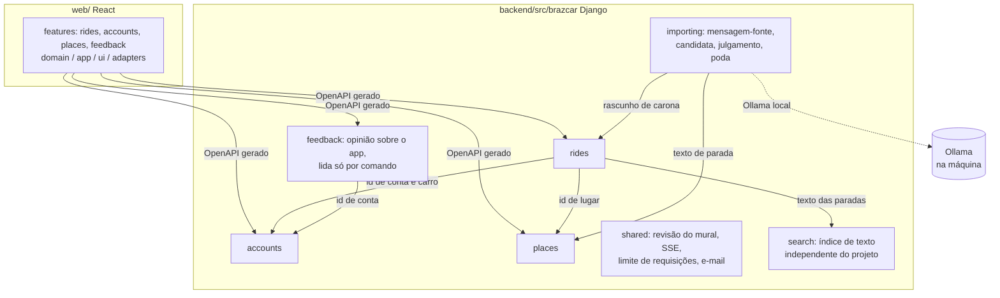

# Arquitetura

## Contexto

```mermaid
flowchart LR
    P[Passageiro] --> W[PWA no Vercel<br/>brazcar.elj-labs.org]
    M[Motorista] --> W
    W -->|HTTPS, cookie de sessão| CF[Cloudflare<br/>túnel]
    CF --> T[Traefik]
    T --> A[API Django ASGI<br/>api-brazcar.elj-labs.org]
    A --> DB[(Banco único<br/>SQLite ou Postgres)]
    A -->|SMTP| R[Resend]
    W -.wa.me.-> WA[WhatsApp]
    X[Worker do extrator<br/>mesma imagem da API] --> DB
    X -.lê.-> WA
```

Tudo que é público passa pelo túnel do Cloudflare: a máquina não tem IP público, e o TLS e o
HTTP/2 são entregues por ele, não pelo Traefik.

## Blocos



Cada contexto é um pacote com três camadas.

| Camada | Contém | Pode importar |
|---|---|---|
| `domain/` | entidades, value objects e eventos, em Pydantic congelado | stdlib, Pydantic, o próprio domínio |
| `application/` | casos de uso `async` e portas (`Protocol`) | o anterior e a própria camada |
| `adapters/` | app Django (models, migrations, comandos), rotas ninja, repositórios | tudo |

Referência entre contextos é por identificador. `shared` guarda infraestrutura que não é de
nenhum contexto.

## Fluxos que importam

**Publicar ou alterar uma carona.** A rota ninja monta o DTO e chama o caso de uso. A entidade
valida as invariantes e emite eventos. O repositório, numa única função síncrona com `atomic`,
grava o estado, acrescenta os eventos ao histórico e incrementa a revisão do mural (ADR-0008).

**Atualizar o mural sem recarregar.** Uma tarefa única no processo web lê a revisão uma vez por
segundo. Quando o número muda, escreve "mudou, revisão N" em todas as conexões SSE abertas. Cada
celular espera até dois segundos aleatórios e busca a lista, que fica em cache por revisão
(ADR-0010). Ao focar a aba ou voltar a rede, o app busca de novo de qualquer forma.
A conexão cai por rotina, porque o túnel a derruba em rajadas e o iOS a mata em segundo plano:
o servidor manda um evento `ping` a cada 15s, e o cliente reconecta sozinho por silêncio (35s), ao
voltar ao foco e ao voltar a rede. Ao reconectar, o primeiro quadro do stream é a revisão atual:
só busca se mudou. Medido pelo caminho real, numa aba e com o app instalado (ADR-0013, ADR-0014).

**Ler os grupos de WhatsApp.** O worker roda o extrator (repo somente leitura, ADR-0009) com um
`DjangoStore` como porta de escrita: só texto de grupo observado, de outra pessoa, com telefone,
vira mensagem-fonte, única por conta e id (D-111). Os grupos são JIDs com rótulo no ambiente (D-109).
O handler do extrator só acorda uma varredura no mesmo processo (D-112). A retenção (D-119) existe
duas vezes de propósito: como caso de uso que a varredura aplica, e como job do `pg_cron` no Postgres
da máquina; um contrato prova que apagam o mesmo. A sessão do WhatsApp fica num papel e schema
próprios do mesmo Postgres (D-040).

**Importar uma carona.** A varredura do worker junta as mensagens não tomadas em candidatas, por
remetente, chave de texto e janela de 6h (D-113), e julga uma candidata por vez: o interpretador
(porta `RideParser`, adaptador Ollama com o JSON schema de `ParserOutput`, ADR-0016) devolve tipo,
horário relativo, paradas como texto, vagas, preço e pagamento; o código resolve as paradas contra o
catálogo e a data a partir do carimbo da mensagem, confere cada valor contra as próprias palavras
(confiança, D-115) e decide (D-116). Aceita, vira `RideOffer` pelo caso de uso `ImportRide` de
`rides`: a conta com aquele telefone, sem carro, ou um motorista externo (ADR-0015, D-127), com o
texto original redigido (D-128). Nada importado sobrevive à partida (D-119).

**Contato.** A lista nunca traz telefone nem placa (schema `RideOut`, D-096). O botão chama uma rota própria, que exige
login, aplica limite por conta, registra o pedido e devolve o link `wa.me` com mensagem pronta e a
placa (ADR-0006).

## Conceitos transversais

- **Banco único e plugável.** O ORM escolhe SQLite ou Postgres pela URL. O contrato de
  repositório roda nos dois bancos para provar isso (ADR-0007).
- **Sessão entre origens irmãs.** Front e API são subdomínios de `elj-labs.org`. Cookie de
  sessão httpOnly com `SameSite=Lax`, CORS com credenciais e checagem de `Origin` por middleware
  em `shared/adapters` (ADR-0012, D-091). O usuário customizado do Django tem o mesmo UUID da
  `Account` do domínio (D-090); a senha é credencial do adaptador, nunca estado do domínio.
- **Contrato da API.** O `contract/openapi.json` é gerado do ninja e versionado. O front gera os
  tipos dele. O CI falha se o arquivo divergir do código.
- **Catálogo de lugares como dado versionado.** `catalog.toml` é a fonte; `sync_places` deixa o
  banco igual a ele no entrypoint, passando pelo agregado (D-087). Busca sem acento, apelidos e
  descendentes são resolvidos em memória, em Python, iguais em qualquer banco (D-083).
- **Busca.** Contexto `search` com a porta `SearchIndex`, sem nada do projeto no núcleo; hoje uma
  tabela com texto normalizado e `contains`, trocável por Redis ou Elasticsearch (D-100).
- **Regras só no backend.** A API devolve a situação calculada e as ações permitidas (ADR-0011).
- **Dados pessoais em texto livre.** `shared/domain/personal_data.py` diz o que parece telefone,
  e-mail, CPF ou placa; a importação redige antes de gravar (D-128) e o formulário passará a recusar
  (D-129). Uma regra só, para nunca haver duas expressões divergindo.
- **Telefone.** Um value object só, `shared/domain/phone/PhoneNumber`, com país, DDD e assinante
  (D-135). A `phonenumbers` entra só por `shared/domain/phone/codec.py`, sem porta, e o teste de
  arquitetura garante isso (D-136); no front, a `libphonenumber-js` só por
  `shared/app/phone-codec.ts`. O que cada contexto aceita fica por cima dele (D-137).
- **Observabilidade.** Logs estruturados em JSON na saída padrão e um endpoint de saúde. Nada de terceiros.
- **Limite de requisições.** Porta `RateLimiter` em `shared/application`, com chave por conta ou por
  telefone e uma tabela de hits como adaptador (D-097). Contato, login e recuperação de senha passam por ela.
- **E-mail.** Porta `Mailer` em `shared/application` com o backend de e-mail do Django como
  adaptador; o fornecedor é variável de ambiente, e sem ele as mensagens vão para o console (D-092).
- **PWA online-only.** O service worker só guarda a casca, nunca a API; sem rede, uma tela de aviso
  cobre a página, que continua montada (D-106). Tudo que conhece o service worker, a rede e o modo
  instalado mora num adaptador de `web/src/shared/adapters`.
- **Versão do app.** Service worker em modo `prompt`: build novo espera o "Atualizar" do usuário e
  pergunta antes de descartar formulário aberto. A API informa o piso em `GET /api/web-version`
  (`WEB_MINIMUM_VERSION`); a versão do front é a do `web/package.json`, que o release acompanha com
  a tag, e abaixo do piso o app só oferece atualizar (D-105).

## Execução

O compose de produção é `infra/compose.yml`, no molde do JayceFinance: serviços `api`, `worker`
(`manage.py run_extractor`, mesma imagem) e `postgres` (imagem própria com `pg_cron`), todos com
`restart: unless-stopped`; só a API na rede externa `web` do Traefik. Imagens vêm do GHCR. O
entrypoint migra só quando `RUN_MIGRATIONS=1`, ligado apenas na API, e o worker espera a API ficar
saudável. O Ollama roda nativo na máquina e o worker o alcança por `host.docker.internal`.

O `compose.yml` da raiz é outro: só oferece o Postgres de desenvolvimento usado pelo contrato de
repositório, na mesma imagem do deploy.

## Qualidade

As camadas de teste, de dentro para fora:

- **Arquitetura por AST** (`backend/tests/test_architecture.py`): varre o código-fonte e recusa
  `domain`/`application` importando Django, ninja ou qualquer SDK, e um contexto importando o
  núcleo de outro (D-075); é o que faz o hexágono valer sem depender de disciplina.
- **Domínio com Hypothesis**: situação da carona (ADR-0003) e regra de atraso (ADR-0004) testadas
  por propriedade, não só por exemplo; o gerador cobre combinações que ninguém escreveria à mão.
- **Contrato de porta nos dois bancos** (D-085): uma classe em `backend/tests/contracts/`,
  herdada pelo fake em memória e pelo adaptador Django; o portão rápido roda em SQLite
  (`poe test`), o pesado repete em Postgres (`poe test-postgres`, D-039).
- **Rotas com a composição real**: ninja, sessão, casos de uso e ORM juntos, sem substituir nada.
- **Fuzz de contrato com Schemathesis** (`poe test-contract-fuzz`, marcador `schemathesis`, D-156):
  fecha o que D-065 previa e nunca tinha sido feito. Sobe a API com `live_server` (pytest-django)
  sobre SQLite, carrega `contract/openapi.json` do arquivo (não busca o schema pela rede) e gera
  dados para cada operação documentada, autenticando as que exigem sessão com uma conta registrada
  na hora, do jeito que os testes de rota autenticam. Roda com toda verificação embutida do
  Schemathesis exceto `positive_data_acceptance`, documentada e excluída em `test_contract_fuzz.py`
  porque assume que corpo com os tipos certos nunca pode voltar 422 — o que não vale aqui, porque
  `StopIn` (e o corpo de outras rotas) usa dois campos opcionais onde exatamente um deve vir
  preenchido, uma regra que OpenAPI não expressa (sem XOR) e que o domínio, não o schema, garante.
  Achou dois defeitos reais: quase toda rota que aceita corpo ou parâmetro de rota podia responder
  404 ou 422 sem que `contract/openapi.json` documentasse esses status — consequência de como o
  ninja trata `HttpError` e `pydantic.ValidationError` por fora do `response=` de cada rota; e toda
  rota com corpo também podia responder 400 (`{"detail": "Cannot parse request body"}`) quando o
  JSON nem chega a ser um JSON válido, antes de existir algo para o pydantic validar. Corrigido
  declarando os status que cada rota alcança de verdade, via o helper `with_errors`
  (`shared/adapters/api_errors.py`), com dois schemas de erro reutilizáveis (`ErrorOut` para o
  `{"detail": "..."}` do `HttpError` e do JSON malformado, `ValidationErrorOut` para a lista do
  `pydantic.ValidationError`, ou o mesmo texto único quando a própria rota reusa 422 como refusal).
- **Uso com `user-event`** (D-154): componente interativo novo ou alterado ganha teste que digita
  tecla a tecla, usa Tab, Enter, Espaço, Esc e setas — `fireEvent.change` e o `fill` do Playwright
  não provam digitação.
- **Ponta a ponta com catálogo** (D-133, D-134): `manage.py seed_demo` enche um banco com uma
  carona de cada situação, passando pelos casos de uso; o Playwright sobe a API com essa semente e
  o front construído, percorre as jornadas e fotografa cada estado por um helper único. As imagens
  ficam em `docs/screens/` e o [catálogo](screens/README.md) é gerado delas. A suíte é task própria
  (`yarn e2e`), fora dos dois portões, e roda também no workflow `e2e.yml`; como se opera está em
  [runbooks/screens.md](runbooks/screens.md). A semente ainda usa ids aleatórios e "agora
  arredondado" como âncora do relógio: `yarn screens` reescreve quase todas as 143 imagens a cada
  rodada mesmo sem mudança real na tela, o que continua pendente (ver ROADMAP).

Quem roda o quê: rápido a cada commit, no hook de `pre-commit` e no GitHub (formatação, lint,
tipos, testes de domínio e de rota, teste de arquitetura, divergência de migração e de OpenAPI,
links da documentação). Pesado, no GitHub e sob demanda local (`poe check-heavy`, `yarn
check:heavy`): tudo do rápido, mais o contrato de repositório repetido no Postgres (serviço do
runner no GitHub, compose localmente), o fuzz de contrato e o build do front. Nenhum hook roda
teste no push: o `pre-push` saiu, e um `commit-msg` de milissegundos recusa assunto fora do
Conventional Commits ou mensagem com trailer ou menção a ferramenta de IA (D-132).

Cobertura é medida só nos fluxos do GitHub, depois do portão rápido: os mesmos testes rápidos com
`pytest-cov` no backend e `@vitest/coverage-v8` no front, resumo impresso no log e falha abaixo do
piso. Os dois lados medem o pacote inteiro: 88,58% medidos sobre `src/brazcar`, com piso de 87%, e
72,23% (linhas: 72,38%) medidos sobre `src` do front, com piso de 70% (D-157) — até este passo o
piso era 15%, porque só os hooks headless tinham teste. A meta continua sendo paridade com o
backend, cobrindo também os componentes visuais e as telas (D-126); adaptadores e hooks estão bem
cobertos agora, a lacuna que resta está nas rotas (`src/routes/`, composição fina por design,
D-072), nas telas que ainda não têm teste de uso e em três adaptadores de ciclo de vida do
navegador (`resilient-event-source.ts`, `service-worker.ts`, `stream-diagnostics-source.ts`).
Nada é enviado para serviço de terceiros (D-008); o piso fica em `backend/poe_tasks.toml` e em
`web/vite.config.ts`.

Verificação feita à mão durante um passo vira teste automatizado no mesmo passo, e bugfix entra com
o teste que o reproduz (D-126).
