# Catálogo de telas

Gerado da versão `v0.15.0` do front. **Não edite à mão:** cada imagem é um estado que a
suíte de ponta a ponta visita, e este arquivo sai das imagens.

```bash
cd web && yarn screens   # roda a suíte, refaz as imagens e reescreve este arquivo
```

As telas são funcionais e sem polimento até a etapa de design (D-103): o que está aqui é o que
existe, fotografado como está. No celular a imagem é a página inteira; no desktop, a janela.

## Celular (`mobile`)

### account

| Tela | Rota | Situação | O que a jornada faz ali |
|---|---|---|---|
| 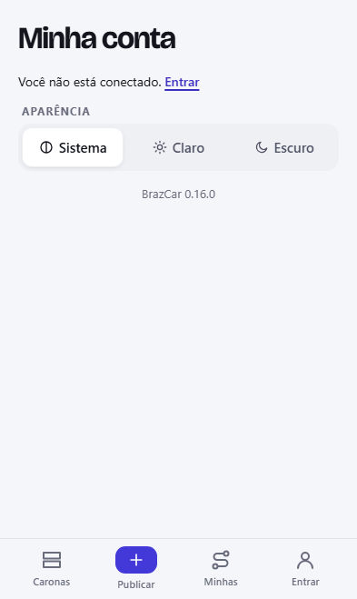<br>Minha conta | `/conta` | `anonymous` | a conta sem sessão manda entrar |
| 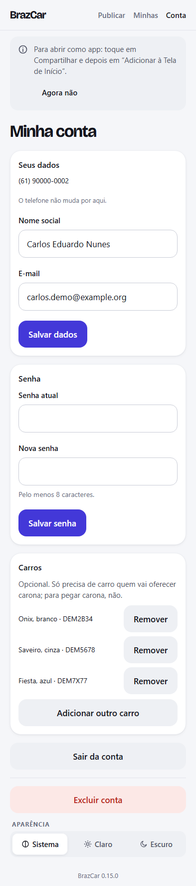<br>Minha conta | `/conta` | `car-added` | carros: cadastrar, ver na lista e remover |
| 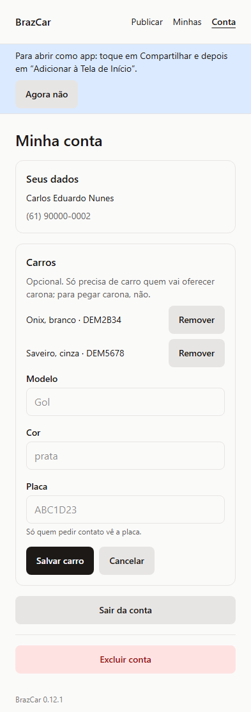<br>Minha conta | `/conta` | `car-form` | carros: cadastrar, ver na lista e remover |
| 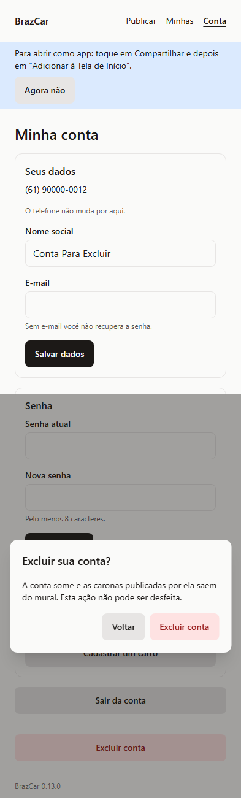<br>Minha conta | `/conta` | `delete-dialog` | excluir conta: o diálogo explica, confirma, e o telefone deixa de servir para entrar |
| 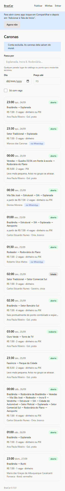<br>Caronas | `/?accountDeleted=true` | `deleted` | excluir conta: o diálogo explica, confirma, e o telefone deixa de servir para entrar |
| 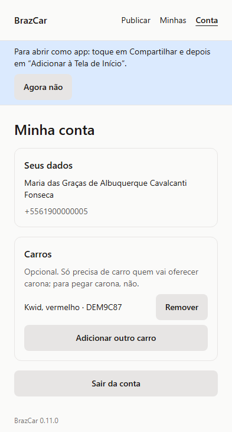<br>Minha conta | `/conta` | `long-name` | nome social longo cabe na conta |
| 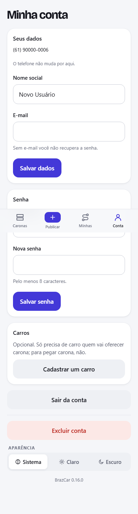<br>Minha conta | `/conta` | `no-cars` | conta nova: nenhum carro, e o convite fala no singular |
| 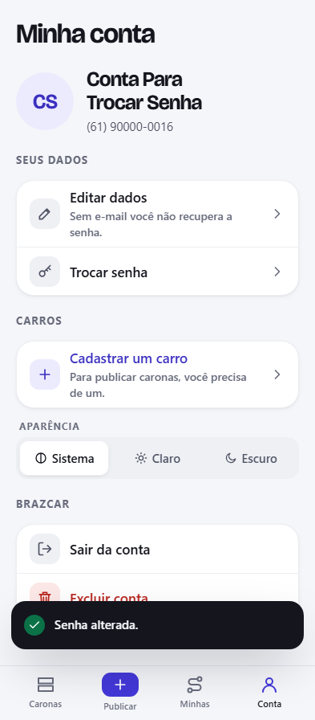<br>Minha conta | `/conta` | `password-changed` | trocar a senha: a nova senha funciona depois de sair e entrar de novo |
| 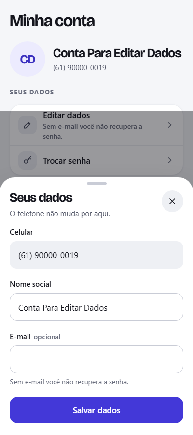<br>Minha conta | `/conta` | `profile-edit` | editar dados: quem não tem e-mail pode adicionar um, e ele fica depois de recarregar |
| 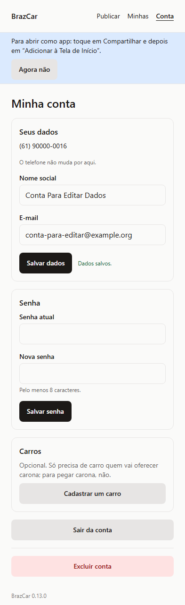<br>Minha conta | `/conta` | `profile-saved` | editar dados: quem não tem e-mail pode adicionar um, e ele fica depois de recarregar |
| <br>Minha conta | `/conta` | `signed-out` | sair da conta devolve o visitante ao mural público |
| 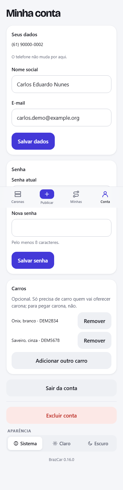<br>Minha conta | `/conta` | `with-cars` | carros: cadastrar, ver na lista e remover |

### board

| Tela | Rota | Situação | O que a jornada faz ali |
|---|---|---|---|
| 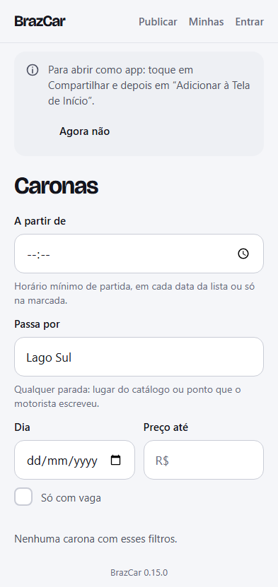<br>Caronas | `/?q=Lago+Sul` | `empty-by-filter` | filtro que não acha nada explica que é filtro |
| 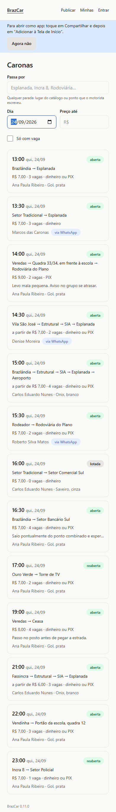<br>Caronas | `/?day=2026-09-25` | `filtered-by-day` | o filtro de dia vive na URL e recorta o mural |
| 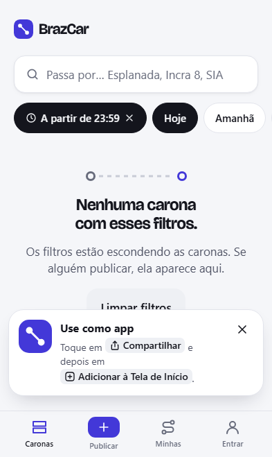<br>Caronas | `/?day=2026-09-25&from=23:59` | `from-time-empty` | o filtro "a partir de" sem carona no horário mostra o estado vazio |
| 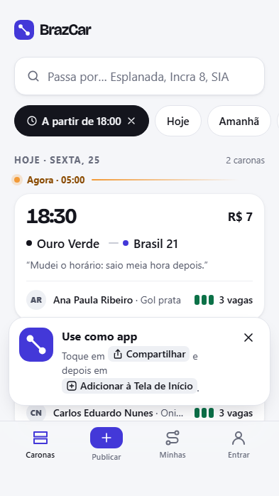<br>Caronas | `/?from=18:00` | `from-time` | o filtro "a partir de" recorta o mural pelo horário local, sem dia e com dia |
| 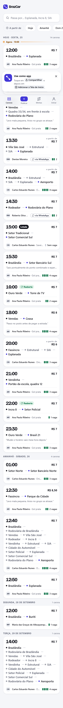<br>Caronas | `/` | `full` | o mural lista as caronas que ainda vão sair, e só elas |
| 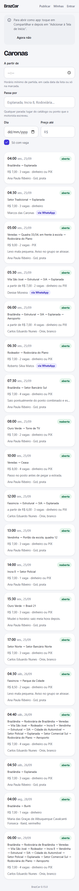<br>Caronas | `/?withSeats=true` | `only-with-seats` | só com vaga tira a lotada do mural |
| 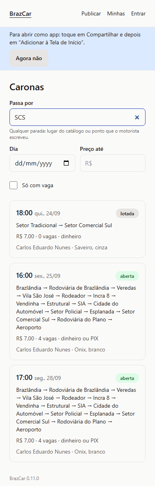<br>Caronas | `/?q=SCS` | `search-by-alias` | "passa por" acha o lugar pelo apelido |
| 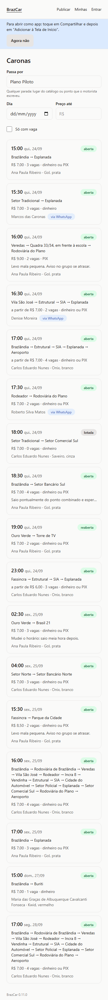<br>Caronas | `/?q=Plano+Piloto` | `search-by-parent` | "passa por" acha o lugar pelo que está acima dele |
| 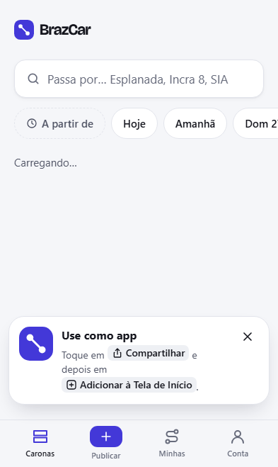<br>Caronas | `/` | `signed-in` | criar conta: os erros aparecem e a conta entra direto no mural |

### contact

| Tela | Rota | Situação | O que a jornada faz ali |
|---|---|---|---|
| 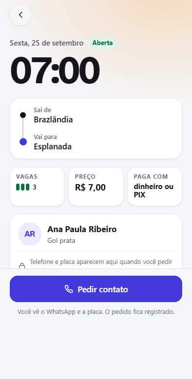<br>Carona | `/caronas/6456eb3f-93a3-445f-b41d-67600a52b957` | `before` | pedir contato revela o WhatsApp e a placa |
| 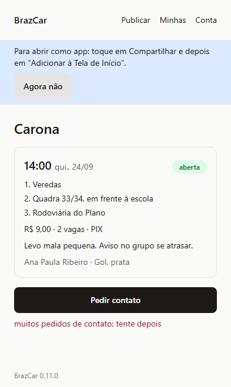<br>Carona | `/caronas/d08a9497-64c3-41d1-8e18-03f6497ec013` | `limit-reached` | com a cota do dia gasta, o pedido é recusado na própria tela |
| 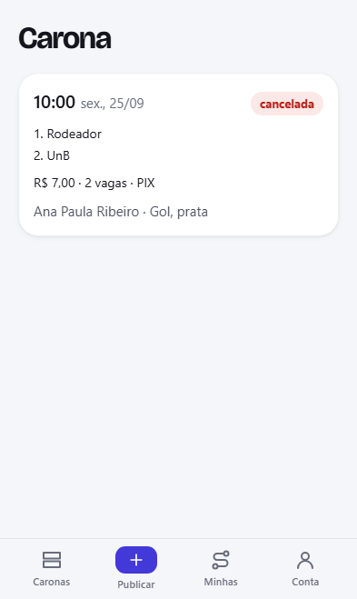<br>Carona | `/caronas/98ea5020-31c4-4d52-9381-9c9b313b17e0` | `none-when-cancelled` | carona cancelada não oferece o botão nem para quem está logado |
| 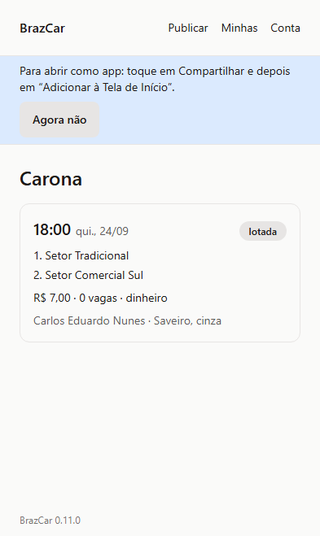<br>Carona | `/caronas/60ce1f3e-0c26-4be4-a7b9-2be8ed9c6ac7` | `none-when-full` | carona lotada não oferece o botão nem para quem está logado |
| 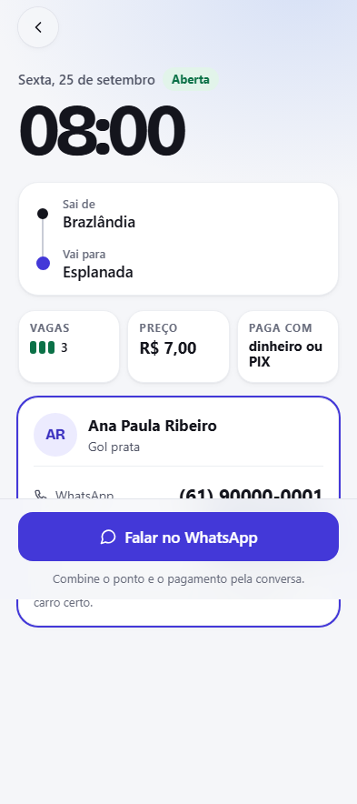<br>Carona | `/caronas/6456eb3f-93a3-445f-b41d-67600a52b957` | `revealed` | pedir contato revela o WhatsApp e a placa |

### edit

| Tela | Rota | Situação | O que a jornada faz ali |
|---|---|---|---|
| 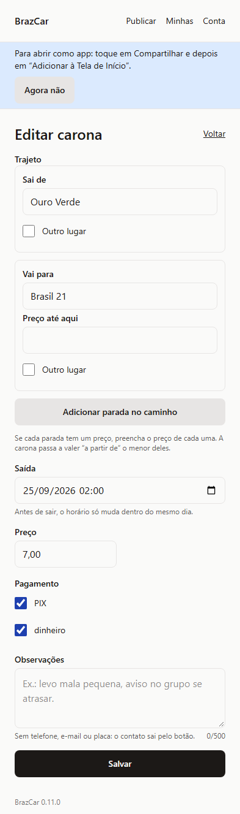<br>Editar carona | `/caronas/a8f0c9a0-b845-4f3a-8e39-de8bb2bfe401/editar` | `form` | editar: o mesmo dia passa, outro dia é recusado |
| 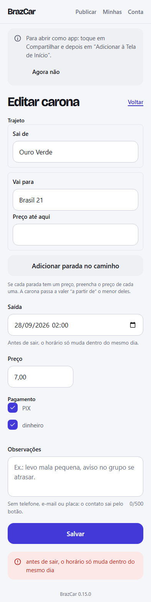<br>Editar carona | `/caronas/a8f0c9a0-b845-4f3a-8e39-de8bb2bfe401/editar` | `other-day-refused` | editar: o mesmo dia passa, outro dia é recusado |

### imported

| Tela | Rota | Situação | O que a jornada faz ali |
|---|---|---|---|
| 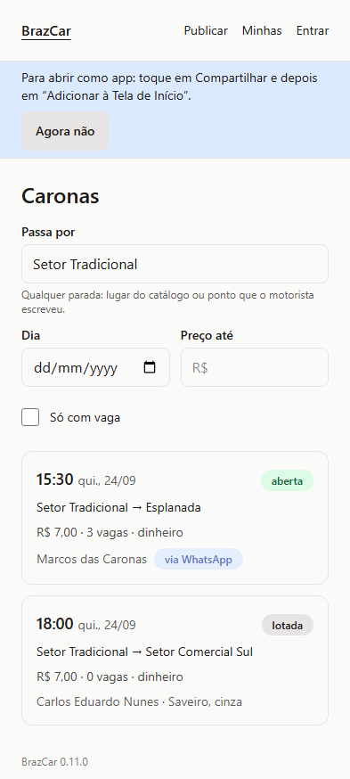<br>Caronas | `/?q=Setor+Tradicional` | `board-card` | o card da importada traz o selo via WhatsApp |
| 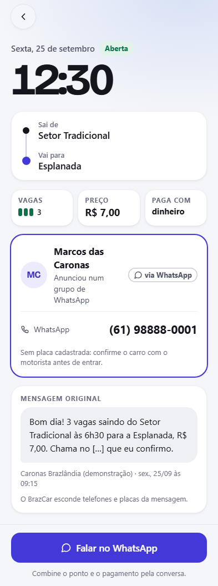<br>Carona | `/caronas/455f7d94-359f-45e3-b9f3-8077523b4277` | `contact-without-plate` | o contato de motorista externo vem sem placa |
| 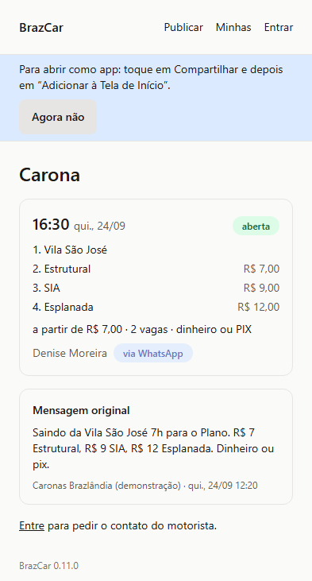<br>Carona | `/caronas/f0f8c622-87af-41bf-8376-85ae50145b09` | `detail-with-fares` | a importada com tarifas mostra o preço de cada parada |
| 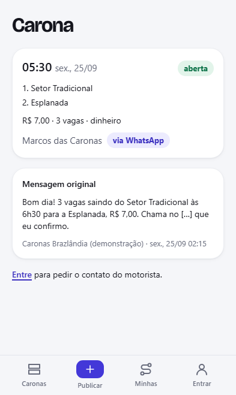<br>Carona | `/caronas/455f7d94-359f-45e3-b9f3-8077523b4277` | `detail` | o detalhe mostra a mensagem original, já redigida |
| 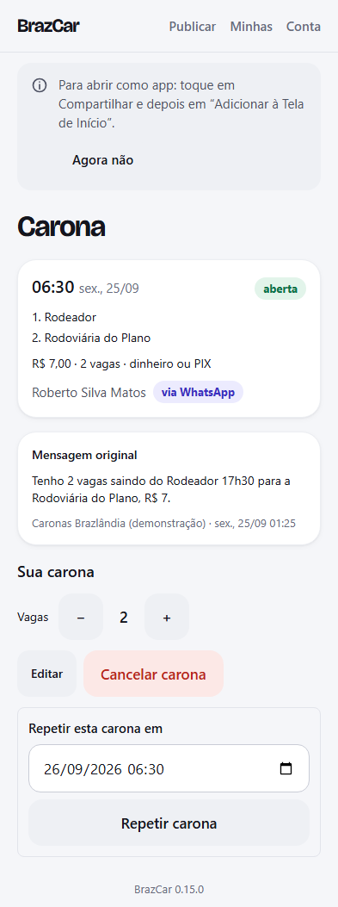<br>Carona | `/caronas/9c744661-966f-4751-aa60-4573d55abd24` | `owned-detail` | a importada de quem tem conta é da dona, e aparece em minhas caronas |
| 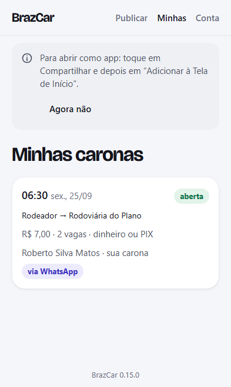<br>Minhas caronas | `/minhas-caronas` | `owned-in-my-rides` | a importada de quem tem conta é da dona, e aparece em minhas caronas |

### login

| Tela | Rota | Situação | O que a jornada faz ali |
|---|---|---|---|
| 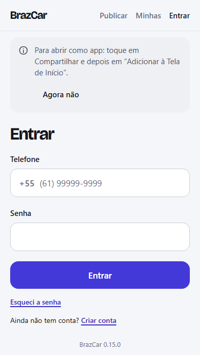<br>Entrar | `/entrar` | `empty` | entrar: senha errada é recusada e a certa leva ao mural |
| 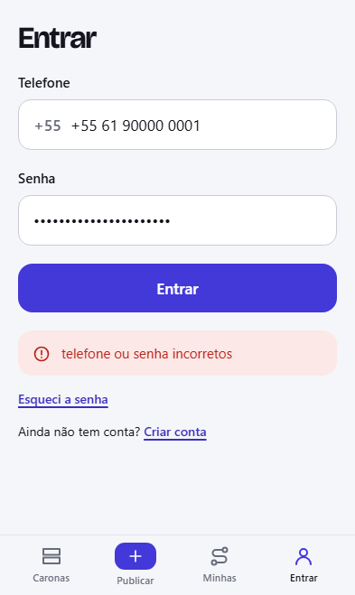<br>Entrar | `/entrar` | `wrong-password` | entrar: senha errada é recusada e a certa leva ao mural |

### my-rides

| Tela | Rota | Situação | O que a jornada faz ali |
|---|---|---|---|
| 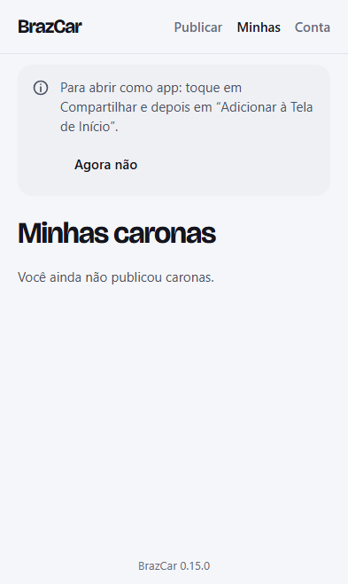<br>Minhas caronas | `/minhas-caronas` | `empty` | minhas caronas de quem nunca publicou |
| 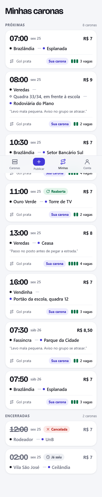<br>Minhas caronas | `/minhas-caronas` | `full` | minhas caronas mostram também a cancelada e a que já saiu |

### password-reset

| Tela | Rota | Situação | O que a jornada faz ali |
|---|---|---|---|
| <br>Redefinir senha | `/redefinir-senha?token=` | `incomplete-link` | link de redefinir sem token pede outro |
| 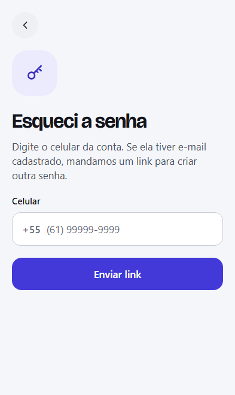<br>Esqueci a senha | `/esqueci-senha` | `request` | esqueci a senha: a resposta é a mesma para qualquer telefone |
| 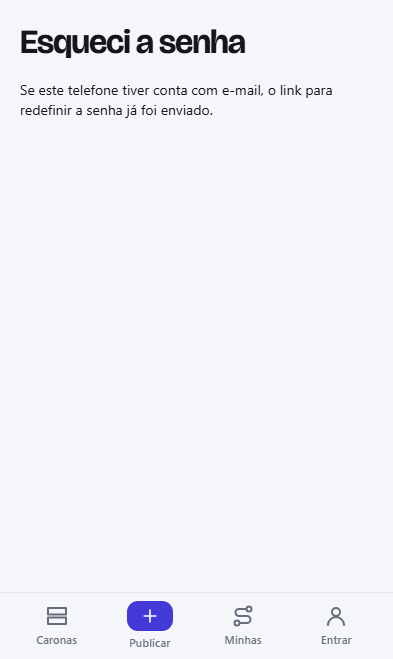<br>Esqueci a senha | `/esqueci-senha` | `sent` | esqueci a senha: a resposta é a mesma para qualquer telefone |

### publish

| Tela | Rota | Situação | O que a jornada faz ali |
|---|---|---|---|
| 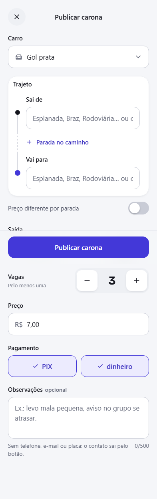<br>Publicar carona | `/publicar` | `empty` | publicar uma carona simples |
| 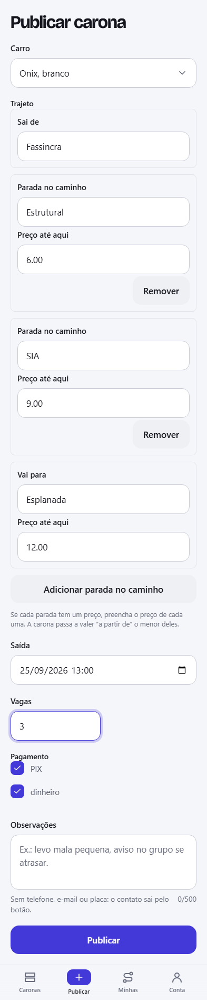<br>Publicar carona | `/publicar` | `fares-per-stop` | com preço por parada, o preço da carona some do formulário |
| 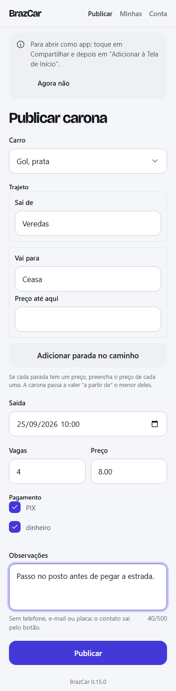<br>Publicar carona | `/publicar` | `filled` | publicar uma carona simples |
| 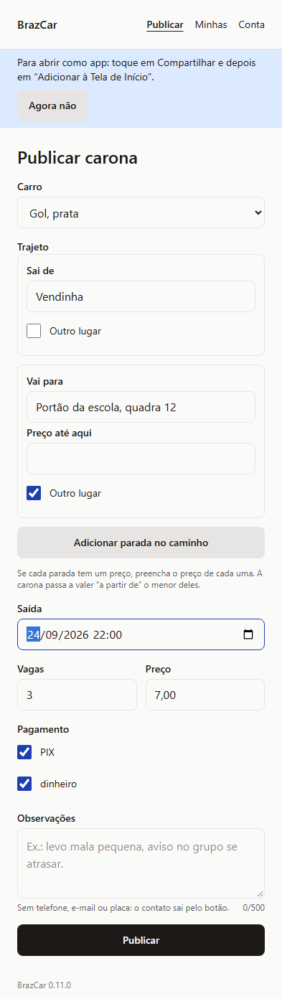<br>Publicar carona | `/publicar` | `free-text-stop` | uma parada em texto livre entra na rota |
| 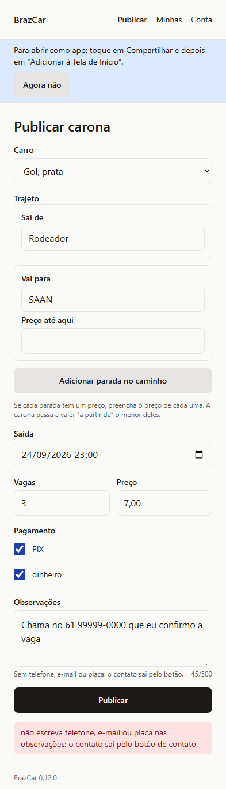<br>Publicar carona | `/publicar` | `personal-data-refused` | observação com telefone é recusada com a frase do botão |
| 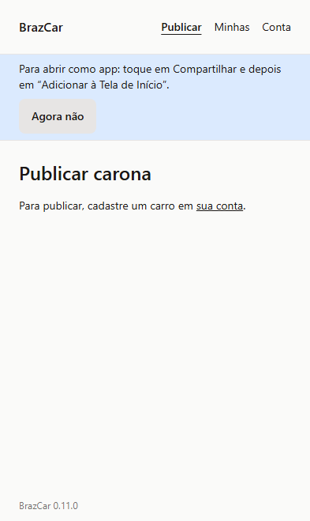<br>Publicar carona | `/publicar` | `without-a-car` | sem carro, publicar manda cadastrar um |

### realtime

| Tela | Rota | Situação | O que a jornada faz ali |
|---|---|---|---|
| 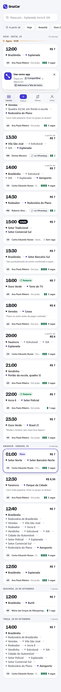<br>Caronas | `/` | `after` | o mural do visitante aprende a carona que outro acabou de publicar |
| 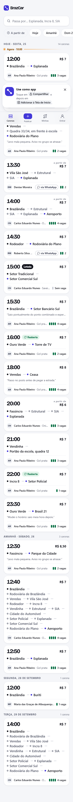<br>Caronas | `/` | `before` | o mural do visitante aprende a carona que outro acabou de publicar |

### ride

| Tela | Rota | Situação | O que a jornada faz ali |
|---|---|---|---|
| 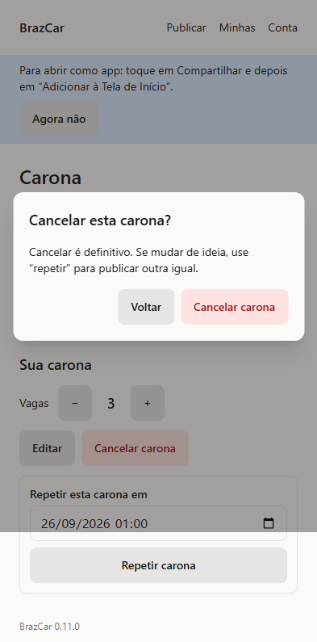<br>Carona | `/caronas/15f028cc-daec-4506-a188-56891f89acf3` | `cancel-dialog` | cancelar pede confirmação e é definitivo |
| 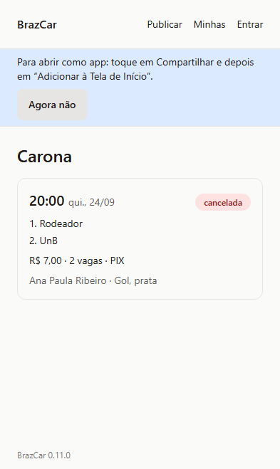<br>Carona | `/caronas/98ea5020-31c4-4d52-9381-9c9b313b17e0` | `cancelled` | carona cancelada continua legível pelo endereço |
| 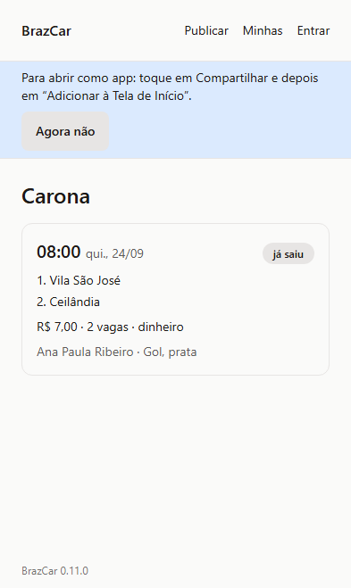<br>Carona | `/caronas/2bf8128d-c63a-457e-84e5-847b89342af2` | `departed` | carona que já saiu não oferece contato |
| <br>Carona | `/caronas/848e812a-47d4-4db6-859a-ade823346d83` | `fares-per-stop` | carona com preço por parada mostra cada tarifa |
| <br>Carona | `/caronas/60ce1f3e-0c26-4be4-a7b9-2be8ed9c6ac7` | `full` | carona lotada não oferece contato |
| <br>Carona | `/caronas/7ad09461-8e9e-499e-9172-c14e2fe9dd0e` | `just-published` | publicar uma carona simples |
| <br>Carona | `/caronas/eca96bd5-ebd9-4128-8ad3-09fdc0d62f7d` | `long-notes` | carona com observações longas mostra o texto inteiro |
| <br>Carona | `/caronas/00000000-0000-4000-8000-000000000000` | `not-found` | endereço de carona que não existe explica o que houve |
| <br>Carona | `/caronas/6456eb3f-93a3-445f-b41d-67600a52b957` | `open-anonymous` | o detalhe de uma carona aberta convida a entrar para pedir contato |
| <br>Carona | `/caronas/15f028cc-daec-4506-a188-56891f89acf3` | `owner-cancelled` | cancelar pede confirmação e é definitivo |
| <br>Carona | `/caronas/a8f0c9a0-b845-4f3a-8e39-de8bb2bfe401` | `owner-edited` | editar: o mesmo dia passa, outro dia é recusado |
| <br>Carona | `/caronas/e25addb2-ddef-49a2-b6c7-537653a427c1` | `owner-full` | o dono fecha e reabre a carona pelas vagas |
| <br>Carona | `/caronas/e25addb2-ddef-49a2-b6c7-537653a427c1` | `owner-open` | o dono fecha e reabre a carona pelas vagas |
| <br>Carona | `/caronas/e25addb2-ddef-49a2-b6c7-537653a427c1` | `owner-reopened` | o dono fecha e reabre a carona pelas vagas |
| <br>Carona | `/caronas/d2688f7a-9a54-4796-b7a0-5ecae9352350` | `repeat-ready` | repetir uma carona publica outra igual em outro horário |
| <br>Carona | `/caronas/43c6201c-878b-43c1-8c05-2fcde955621c` | `repeated` | repetir uma carona publica outra igual em outro horário |

### shell

| Tela | Rota | Situação | O que a jornada faz ali |
|---|---|---|---|
| <br>Caronas | `/` | `install-hint` | no iPhone, a dica de instalar aparece e some quando dispensada |
| <br>Sem internet | `/` | `offline` | sem internet o app avisa por cima da página |
| <br>Página não encontrada | `/uma-pagina-que-nao-existe` | `route-not-found` | endereço que não é rota nenhuma explica em português e leva ao mural |
| <br>Atualize o BrazCar | `/` | `version-required` | abaixo do piso de versão o app só oferece atualizar |

### signup

| Tela | Rota | Situação | O que a jornada faz ali |
|---|---|---|---|
| <br>Criar conta | `/cadastro` | `empty` | criar conta: os erros aparecem e a conta entra direto no mural |
| <br>Criar conta | `/cadastro` | `phone-formatted` | criar conta: os erros aparecem e a conta entra direto no mural |
| <br>Criar conta | `/cadastro` | `refused` | criar conta: os erros aparecem e a conta entra direto no mural |

## Desktop (`desktop`)

### account

| Tela | Rota | Situação | O que a jornada faz ali |
|---|---|---|---|
| <br>Minha conta | `/conta` | `anonymous` | a conta sem sessão manda entrar |
| <br>Minha conta | `/conta` | `car-added` | carros: cadastrar, ver na lista e remover |
| <br>Minha conta | `/conta` | `car-form` | carros: cadastrar, ver na lista e remover |
| <br>Minha conta | `/conta` | `delete-dialog` | excluir conta: o diálogo explica, confirma, e o telefone deixa de servir para entrar |
| <br>Caronas | `/?accountDeleted=true` | `deleted` | excluir conta: o diálogo explica, confirma, e o telefone deixa de servir para entrar |
| <br>Minha conta | `/conta` | `long-name` | nome social longo cabe na conta |
| <br>Minha conta | `/conta` | `no-cars` | conta nova: nenhum carro, e o convite fala no singular |
| <br>Minha conta | `/conta` | `password-changed` | trocar a senha: a nova senha funciona depois de sair e entrar de novo |
| <br>Minha conta | `/conta` | `profile-edit` | editar dados: quem não tem e-mail pode adicionar um, e ele fica depois de recarregar |
| <br>Minha conta | `/conta` | `profile-saved` | editar dados: quem não tem e-mail pode adicionar um, e ele fica depois de recarregar |
| <br>Minha conta | `/conta` | `signed-out` | sair da conta devolve o visitante ao mural público |
| <br>Minha conta | `/conta` | `with-cars` | carros: cadastrar, ver na lista e remover |

### board

| Tela | Rota | Situação | O que a jornada faz ali |
|---|---|---|---|
| <br>Caronas | `/?q=Lago+Sul` | `empty-by-filter` | filtro que não acha nada explica que é filtro |
| <br>Caronas | `/?day=2026-09-25` | `filtered-by-day` | o filtro de dia vive na URL e recorta o mural |
| <br>Caronas | `/?day=2026-09-25&from=23:59` | `from-time-empty` | o filtro "a partir de" sem carona no horário mostra o estado vazio |
| <br>Caronas | `/?from=18:00` | `from-time` | o filtro "a partir de" recorta o mural pelo horário local, sem dia e com dia |
| <br>Caronas | `/` | `full` | o mural lista as caronas que ainda vão sair, e só elas |
| <br>Caronas | `/?withSeats=true` | `only-with-seats` | só com vaga tira a lotada do mural |
| <br>Caronas | `/?q=SCS` | `search-by-alias` | "passa por" acha o lugar pelo apelido |
| <br>Caronas | `/?q=Plano+Piloto` | `search-by-parent` | "passa por" acha o lugar pelo que está acima dele |
| <br>Caronas | `/` | `signed-in` | criar conta: os erros aparecem e a conta entra direto no mural |

### contact

| Tela | Rota | Situação | O que a jornada faz ali |
|---|---|---|---|
| <br>Carona | `/caronas/6456eb3f-93a3-445f-b41d-67600a52b957` | `before` | pedir contato revela o WhatsApp e a placa |
| <br>Carona | `/caronas/d08a9497-64c3-41d1-8e18-03f6497ec013` | `limit-reached` | com a cota do dia gasta, o pedido é recusado na própria tela |
| <br>Carona | `/caronas/98ea5020-31c4-4d52-9381-9c9b313b17e0` | `none-when-cancelled` | carona cancelada não oferece o botão nem para quem está logado |
| <br>Carona | `/caronas/60ce1f3e-0c26-4be4-a7b9-2be8ed9c6ac7` | `none-when-full` | carona lotada não oferece o botão nem para quem está logado |
| <br>Carona | `/caronas/6456eb3f-93a3-445f-b41d-67600a52b957` | `revealed` | pedir contato revela o WhatsApp e a placa |

### edit

| Tela | Rota | Situação | O que a jornada faz ali |
|---|---|---|---|
| <br>Editar carona | `/caronas/a53bb740-a8c6-4bd8-86f2-cc95cec6aad2/editar` | `form` | editar: o mesmo dia passa, outro dia é recusado |
| <br>Editar carona | `/caronas/a53bb740-a8c6-4bd8-86f2-cc95cec6aad2/editar` | `other-day-refused` | editar: o mesmo dia passa, outro dia é recusado |

### imported

| Tela | Rota | Situação | O que a jornada faz ali |
|---|---|---|---|
| <br>Caronas | `/?q=Setor+Tradicional` | `board-card` | o card da importada traz o selo via WhatsApp |
| <br>Carona | `/caronas/455f7d94-359f-45e3-b9f3-8077523b4277` | `contact-without-plate` | o contato de motorista externo vem sem placa |
| <br>Carona | `/caronas/f0f8c622-87af-41bf-8376-85ae50145b09` | `detail-with-fares` | a importada com tarifas mostra o preço de cada parada |
| <br>Carona | `/caronas/455f7d94-359f-45e3-b9f3-8077523b4277` | `detail` | o detalhe mostra a mensagem original, já redigida |
| <br>Carona | `/caronas/9c744661-966f-4751-aa60-4573d55abd24` | `owned-detail` | a importada de quem tem conta é da dona, e aparece em minhas caronas |
| <br>Minhas caronas | `/minhas-caronas` | `owned-in-my-rides` | a importada de quem tem conta é da dona, e aparece em minhas caronas |

### login

| Tela | Rota | Situação | O que a jornada faz ali |
|---|---|---|---|
| <br>Entrar | `/entrar` | `empty` | entrar: senha errada é recusada e a certa leva ao mural |
| <br>Entrar | `/entrar` | `wrong-password` | entrar: senha errada é recusada e a certa leva ao mural |

### my-rides

| Tela | Rota | Situação | O que a jornada faz ali |
|---|---|---|---|
| <br>Minhas caronas | `/minhas-caronas` | `empty` | minhas caronas de quem nunca publicou |
| <br>Minhas caronas | `/minhas-caronas` | `full` | minhas caronas mostram também a cancelada e a que já saiu |

### password-reset

| Tela | Rota | Situação | O que a jornada faz ali |
|---|---|---|---|
| <br>Redefinir senha | `/redefinir-senha?token=` | `incomplete-link` | link de redefinir sem token pede outro |
| <br>Esqueci a senha | `/esqueci-senha` | `request` | esqueci a senha: a resposta é a mesma para qualquer telefone |
| <br>Esqueci a senha | `/esqueci-senha` | `sent` | esqueci a senha: a resposta é a mesma para qualquer telefone |

### publish

| Tela | Rota | Situação | O que a jornada faz ali |
|---|---|---|---|
| <br>Publicar carona | `/publicar` | `empty` | publicar uma carona simples |
| <br>Publicar carona | `/publicar` | `fares-per-stop` | com preço por parada, o preço da carona some do formulário |
| <br>Publicar carona | `/publicar` | `filled` | publicar uma carona simples |
| <br>Publicar carona | `/publicar` | `free-text-stop` | uma parada em texto livre entra na rota |
| <br>Publicar carona | `/publicar` | `personal-data-refused` | observação com telefone é recusada com a frase do botão |
| <br>Publicar carona | `/publicar` | `without-a-car` | sem carro, publicar manda cadastrar um |

### realtime

| Tela | Rota | Situação | O que a jornada faz ali |
|---|---|---|---|
| <br>Caronas | `/` | `after` | o mural do visitante aprende a carona que outro acabou de publicar |
| <br>Caronas | `/` | `before` | o mural do visitante aprende a carona que outro acabou de publicar |

### ride

| Tela | Rota | Situação | O que a jornada faz ali |
|---|---|---|---|
| <br>Carona | `/caronas/1f1a7e90-78c5-480c-89eb-c6ea4819f083` | `cancel-dialog` | cancelar pede confirmação e é definitivo |
| <br>Carona | `/caronas/98ea5020-31c4-4d52-9381-9c9b313b17e0` | `cancelled` | carona cancelada continua legível pelo endereço |
| <br>Carona | `/caronas/2bf8128d-c63a-457e-84e5-847b89342af2` | `departed` | carona que já saiu não oferece contato |
| <br>Carona | `/caronas/848e812a-47d4-4db6-859a-ade823346d83` | `fares-per-stop` | carona com preço por parada mostra cada tarifa |
| <br>Carona | `/caronas/60ce1f3e-0c26-4be4-a7b9-2be8ed9c6ac7` | `full` | carona lotada não oferece contato |
| <br>Carona | `/caronas/947dbc12-8d76-43b0-8d7b-4ad7d7231e80` | `just-published` | publicar uma carona simples |
| <br>Carona | `/caronas/eca96bd5-ebd9-4128-8ad3-09fdc0d62f7d` | `long-notes` | carona com observações longas mostra o texto inteiro |
| <br>Carona | `/caronas/00000000-0000-4000-8000-000000000000` | `not-found` | endereço de carona que não existe explica o que houve |
| <br>Carona | `/caronas/6456eb3f-93a3-445f-b41d-67600a52b957` | `open-anonymous` | o detalhe de uma carona aberta convida a entrar para pedir contato |
| <br>Carona | `/caronas/1f1a7e90-78c5-480c-89eb-c6ea4819f083` | `owner-cancelled` | cancelar pede confirmação e é definitivo |
| <br>Carona | `/caronas/a53bb740-a8c6-4bd8-86f2-cc95cec6aad2` | `owner-edited` | editar: o mesmo dia passa, outro dia é recusado |
| <br>Carona | `/caronas/1a5deac0-4862-4b54-9f17-90cf62a0739c` | `owner-full` | o dono fecha e reabre a carona pelas vagas |
| <br>Carona | `/caronas/1a5deac0-4862-4b54-9f17-90cf62a0739c` | `owner-open` | o dono fecha e reabre a carona pelas vagas |
| <br>Carona | `/caronas/1a5deac0-4862-4b54-9f17-90cf62a0739c` | `owner-reopened` | o dono fecha e reabre a carona pelas vagas |
| <br>Carona | `/caronas/d2688f7a-9a54-4796-b7a0-5ecae9352350` | `repeat-ready` | repetir uma carona publica outra igual em outro horário |
| <br>Carona | `/caronas/e3d6070e-5a2f-4042-a04e-cb838c0fb06a` | `repeated` | repetir uma carona publica outra igual em outro horário |

### shell

| Tela | Rota | Situação | O que a jornada faz ali |
|---|---|---|---|
| <br>Sem internet | `/` | `offline` | sem internet o app avisa por cima da página |
| <br>Página não encontrada | `/uma-pagina-que-nao-existe` | `route-not-found` | endereço que não é rota nenhuma explica em português e leva ao mural |
| <br>Atualize o BrazCar | `/` | `version-required` | abaixo do piso de versão o app só oferece atualizar |

### signup

| Tela | Rota | Situação | O que a jornada faz ali |
|---|---|---|---|
| <br>Criar conta | `/cadastro` | `empty` | criar conta: os erros aparecem e a conta entra direto no mural |
| <br>Criar conta | `/cadastro` | `phone-formatted` | criar conta: os erros aparecem e a conta entra direto no mural |
| <br>Criar conta | `/cadastro` | `refused` | criar conta: os erros aparecem e a conta entra direto no mural |
